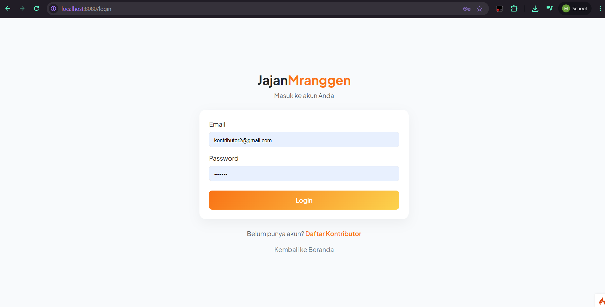
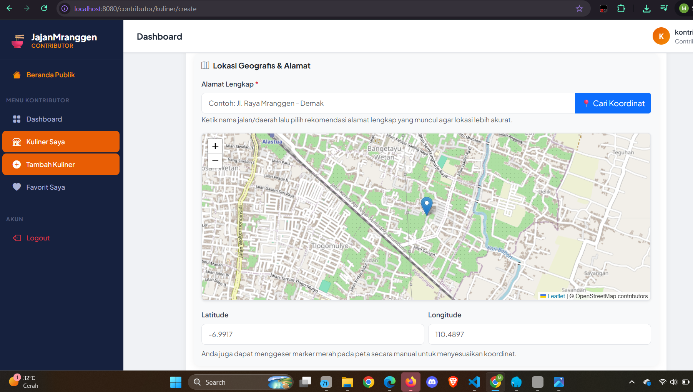
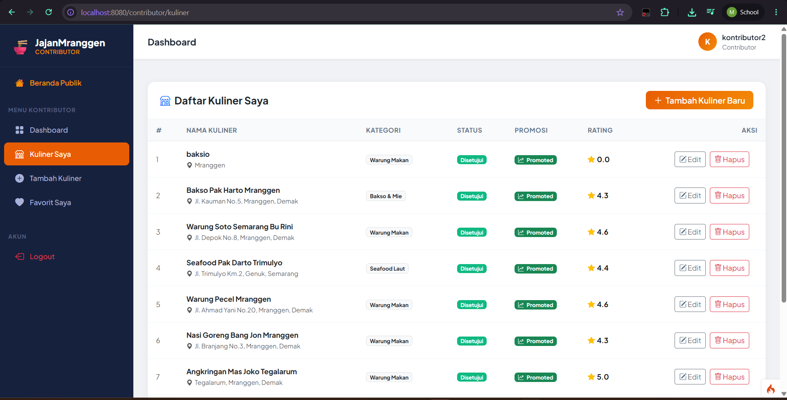
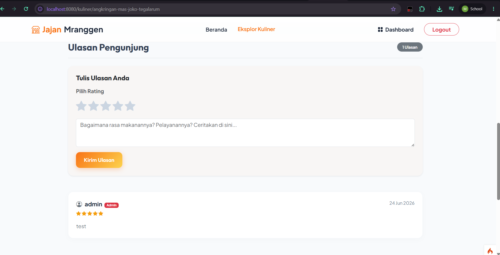
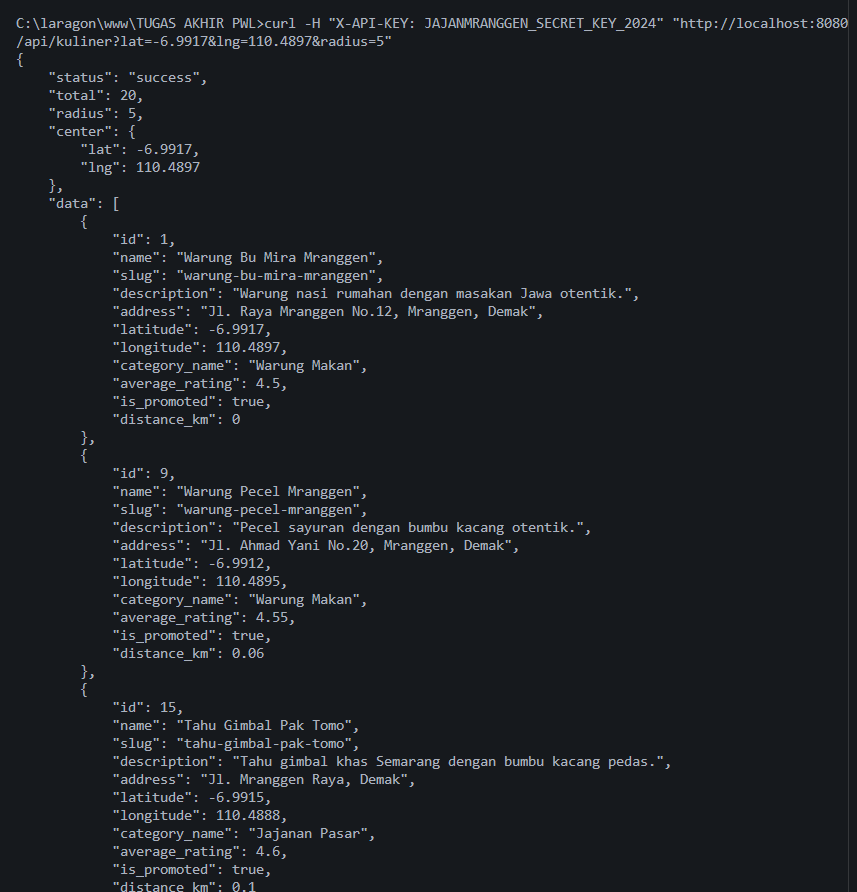
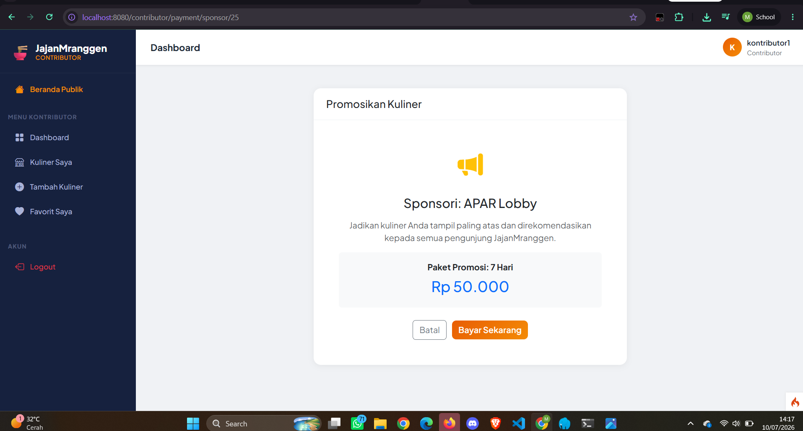

# JajanMranggen - Kuliner Review Platform

Platform berbasis web untuk menemukan, menambahkan, dan mengulas tempat makan atau jajanan di sekitar Mranggen, Demak. Dibangun dengan **CodeIgniter 4**, dilengkapi integrasi geocoding (**OpenStreetMap Nominatim API**), peta interaktif (**Leaflet.js**), REST API publik, dan pembayaran sponsor (**DOKU Payment Gateway**).

---

## Fitur Utama

- **Peta Interaktif & Geocoding** - Otomatis mendeteksi koordinat dari teks alamat menggunakan Nominatim API, ditampilkan dengan Leaflet.js
- **Multi-Role Auth (Admin & Kontributor)** - Sistem autentikasi session dengan pembatasan akses per role
- **CRUD Kuliner** - Kontributor dapat menambah, mengedit, dan menghapus data kuliner
- **Review & Rating** - Sistem ulasan dengan auto-calculate rata-rata rating
- **Favorit (Bookmark)** - Simpan tempat kuliner favorit menggunakan AJAX
- **Auto-Resize Upload** - Otomatis memperkecil resolusi foto menggunakan CI4 Image Manipulation
- **REST API Endpoint** - Endpoint `GET /api/kuliner` untuk akses data spasial (dilindungi API Key)
- **DOKU Payment Gateway** - Fitur sponsor kuliner dengan integrasi DOKU sandbox
- **Notifikasi WhatsApp & Email** - Kirim notifikasi otomatis via Fonnte API dan SMTP

---

## Tech Stack

| Komponen | Teknologi |
|----------|-----------|
| Framework | CodeIgniter 4 |
| Database | MySQL / MariaDB |
| Frontend | Bootstrap 5, Vanilla CSS, Bootstrap Icons |
| Maps | Leaflet.js + OpenStreetMap |
| Geocoding | Nominatim API (OpenStreetMap) |
| Payment | DOKU Payment Gateway (Sandbox) |
| WA Notification | Fonnte API |
| Email | SMTP (Mailtrap untuk testing) |

---

## Cara Instalasi

### Prasyarat

| Software | Versi Minimal | Keterangan |
|----------|--------------|------------|
| PHP | 8.1+ | Ekstensi: `curl`, `mbstring`, `mysqli`, `intl`, `openssl`, `gd` |
| Composer | 2.x | Dependency manager PHP |
| MySQL / MariaDB | 5.7+ / 10.4+ | Database server |
| Web Server | Apache / Nginx | Bisa pakai Laragon/XAMPP |

### Langkah 1 - Clone Repository

```bash
git clone https://github.com/norelac/jajanmranggen-2-.git
cd jajanmranggen-2-/jajanmranggen
```

### Langkah 2 - Install Dependency

```bash
composer install
```

### Langkah 3 - Konfigurasi Environment

Copy file `.env.example` menjadi `.env`:

```bash
cp .env.example .env
```

Lalu edit file `.env` dan isi nilai berikut:

```env
CI_ENVIRONMENT = development
app.baseURL = 'http://localhost:8080/'

# Database
database.default.hostname = localhost
database.default.database = jajanmranggen
database.default.username = root
database.default.password =

# DOKU Payment Gateway (Sandbox)
doku.clientId = BRN-XXXX-XXXXXXXXXXXX
doku.sharedKey = SK-XXXXXXXXXXXXXXXXXXXX
doku.isProduction = false

# Email (Mailtrap untuk testing)
email.SMTPHost = sandbox.smtp.mailtrap.io
email.SMTPUser = YOUR_MAILTRAP_USER
email.SMTPPass = YOUR_MAILTRAP_PASSWORD
email.SMTPPort = 2525

# Fonnte WA Notification
fonnte.token = YOUR_FONNTE_TOKEN

# API Key
api.secretKey = JAJANMRANGGEN_SECRET_KEY_2024
```

> **Catatan:** Untuk testing lokal, Anda bisa menggunakan akun Mailtrap (gratis) untuk SMTP dan Fonnte (gratis) untuk WhatsApp notification.

### Langkah 4 - Buat Database

Buka phpMyAdmin atau MySQL CLI, buat database baru:

```sql
CREATE DATABASE jajanmranggen CHARACTER SET utf8mb4 COLLATE utf8mb4_general_ci;
```

### Langkah 5 - Jalankan Migration & Seeder

```bash
php spark migrate
php spark db:seed MainSeeder
```

Perintah ini akan:
- Membuat tabel: `users`, `categories`, `kuliner`, `reviews`, `favorites`, `payments`, dll.
- Mengisi data awal: 3 user, 6 kategori, 20 kuliner dummy

### Langkah 6 - Jalankan Server

```bash
php spark serve
```

Akses aplikasi di: **http://localhost:8080**

---

## Akun Demo

Seeder otomatis membuatkan akun berikut untuk testing:

| Role | Email | Password |
|------|-------|----------|
| **Admin** | `admin@jajanmranggen.com` | `admin123` |
| **Kontributor 1** | `kontributor1@gmail.com` | `pass123` |
| **Kontributor 2** | `kontributor2@gmail.com` | `pass123` |

---

## Konfigurasi .env

Pastikan semua variabel berikut sudah terisi di file `.env`:

| Variabel | Keterangan | Contoh |
|----------|-----------|--------|
| `database.default.hostname` | Host database | `localhost` |
| `database.default.database` | Nama database | `jajanmranggen` |
| `database.default.username` | Username MySQL | `root` |
| `database.default.password` | Password MySQL | (kosong untuk Laragon/XAMPP) |
| `doku.clientId` | Client ID DOKU Sandbox | `BRN-0254-XXXXXXXXXXXX` |
| `doku.sharedKey` | Shared Key DOKU Sandbox | `SK-XXXXXXXXXXXXXXXX` |
| `doku.isProduction` | Mode production | `false` (sandbox) |
| `email.SMTPHost` | SMTP host | `sandbox.smtp.mailtrap.io` |
| `email.SMTPUser` | SMTP username | dari Mailtrap |
| `email.SMTPPass` | SMTP password | dari Mailtrap |
| `fonnte.token` | Token Fonnte API | dari fonnte.com |
| `api.secretKey` | API Key untuk REST API | `JAJANMRANGGEN_SECRET_KEY_2024` |

---

## Screenshot Fitur Utama

### Halaman Login


### Dashboard Admin


### Dashboard Kontributor


### Peta Interaktif & Geocoding


### CRUD Kuliner


### Review & Rating


### REST API Endpoint


### Payment Gateway (DOKU)


### Notifikasi WhatsApp & Email


---

## REST API

### Endpoint: Cari Kuliner Terdekat

```
GET /api/kuliner
```

**Headers:**

| Header | Nilai |
|--------|-------|
| `X-API-KEY` | `JAJANMRANGGEN_SECRET_KEY_2024` |

**Query Parameters:**

| Parameter | Tipe | Required | Default | Deskripsi |
|-----------|------|----------|---------|-----------|
| `lat` | float | Ya | - | Latitude titik pusat |
| `lng` | float | Ya | - | Longitude titik pusat |
| `radius` | float | Tidak | `5` | Radius pencarian dalam km (max 50) |
| `category` | string | Tidak | - | Slug kategori (contoh: `bakso-mie`) |

**Contoh Request:**

```http
GET /api/kuliner?lat=-6.983&lng=110.409&radius=3&category=bakso-mie
X-API-KEY: JAJANMRANGGEN_SECRET_KEY_2024
```

**Contoh Response (200 OK):**

```json
{
    "status": "success",
    "total": 2,
    "data": [
        {
            "id": 5,
            "name": "Bakso Pak Edi",
            "slug": "bakso-pak-edi",
            "address": "Jl. Veteran No.15, Semarang",
            "latitude": -6.985,
            "longitude": 110.412,
            "category_name": "Bakso & Mie",
            "average_rating": 4.50,
            "is_promoted": 1,
            "distance": 0.42
        }
    ]
}
```

**Error Response (401 - API Key tidak valid):**

```json
{
    "status": "error",
    "message": "API Key tidak valid."
}
```

---

## Struktur Project

```
jajanmranggen/
├── app/
│   ├── Config/              # Konfigurasi (Routes, Database, Email, Filters)
│   ├── Controllers/
│   │   ├── Admin/           # Controller admin (Dashboard, KulinerAdmin, Kategori, Tags, Users, Reviews, Payments)
│   │   ├── Api/             # Controller API (KulinerApi, PaymentNotification)
│   │   ├── Contributor/     # Controller kontributor (Dashboard, KulinerContributor, Payment)
│   │   └── ...
│   ├── Database/
│   │   ├── Migrations/      # File migrasi database (9 tabel)
│   │   └── Seeds/           # Seeder data dummy (UserSeeder, CategorySeeder, KulinerSeeder)
│   ├── Filters/             # Filter (AuthFilter, AdminFilter, ContributorFilter, ApiKeyFilter)
│   ├── Libraries/           # Library (WhatsappNotification)
│   ├── Models/              # Model database (8 model)
│   └── Views/               # Template view (admin, contributor, auth, kuliner, favorites, payment)
├── public/                  # Entry point (index.php, assets, uploads)
├── writable/                # Cache, logs, session
├── tests/                   # Unit test (AuthTest, ReviewRatingTest)
├── .env.example             # Template environment
├── composer.json            # Dependency PHP
└── README.md                # Dokumentasi project
```

---

## ERD (Entity Relationship Diagram)

```
┌─────────────────┐       ┌─────────────────┐
│     users        │       │   categories     │
├─────────────────┤       ├─────────────────┤
│ id (PK)         │       │ id (PK)         │
│ username        │       │ name            │
│ email           │       │ slug            │
│ password        │       │ description     │
│ role            │       │ created_at      │
│ phone           │       │ updated_at      │
│ created_at      │       └────────┬────────┘
│ updated_at      │                │
└────────┬────────┘                │
         │                         │
         │ 1:N                     │ 1:N
         │                         │
         ▼                         ▼
┌─────────────────────────────────────────┐
│              kuliner                     │
├─────────────────────────────────────────┤
│ id (PK)                                │
│ name                                   │
│ slug                                   │
│ description                            │
│ address                                │
│ latitude                               │
│ longitude                              │
│ category_id (FK → categories.id)       │
│ contributor_id (FK → users.id)         │
│ status (pending/approved/rejected)     │
│ average_rating                         │
│ is_promoted                            │
│ promoted_until                         │
│ created_at                             │
│ updated_at                             │
└───┬──────────┬──────────┬──────────────┘
    │          │          │
    │ 1:N      │ 1:N      │ 1:N
    ▼          ▼          ▼
┌────────┐ ┌────────┐ ┌─────────────┐
│reviews │ │photos  │ │  favorites   │
├────────┤ ├────────┤ ├─────────────┤
│id (PK) │ │id (PK) │ │id (PK)      │
│kuliner_│ │kuliner_│ │user_id (FK) │
│  id(FK)│ │  id(FK)│ │kuliner_id   │
│user_id │ │filename│ │  (FK)       │
│  (FK)  │ │is_prima│ │created_at   │
│rating  │ │ry      │ └─────────────┘
│comment │ │created_│
│created_│ │  at    │
│  at    │ │updated_│
│updated_│ │  at    │
│  at    │ └────────┘
└────────┘

┌─────────────────────────────────────────┐
│             payments                     │
├─────────────────────────────────────────┤
│ id (PK)                                │
│ user_id (FK → users.id)                │
│ kuliner_id (FK → kuliner.id)           │
│ invoice_number (UNIQUE)                │
│ amount                                 │
│ status (pending/paid/expired/failed)   │
│ snap_token                             │
│ payment_method                         │
│ created_at                             │
│ updated_at                             │
└─────────────────────────────────────────┘

┌─────────────────┐
│      tags        │
├─────────────────┤
│ id (PK)         │
│ name            │
│ slug            │
│ created_at      │
│ updated_at      │
└─────────────────┘

┌─────────────────────┐
│   kuliner_tags       │
├─────────────────────┤
│ kuliner_id (FK→PK)  │
│ tag_id (FK→PK)      │
└─────────────────────┘
```

**Relasi:**
- `users` 1:N `kuliner` (kontributor)
- `users` 1:N `reviews` (pembuat review)
- `users` 1:N `favorites`
- `users` 1:N `payments`
- `categories` 1:N `kuliner`
- `kuliner` 1:N `reviews`
- `kuliner` 1:N `photos`
- `kuliner` 1:N `favorites`
- `kuliner` 1:N `payments`
- `kuliner` M:N `tags` (via pivot `kuliner_tags`)

---

## License

MIT License

---

> Dibuat untuk memenuhi tugas akhir Pemrograman Web Lanjut - Universitas Dian Nuswantoro.
